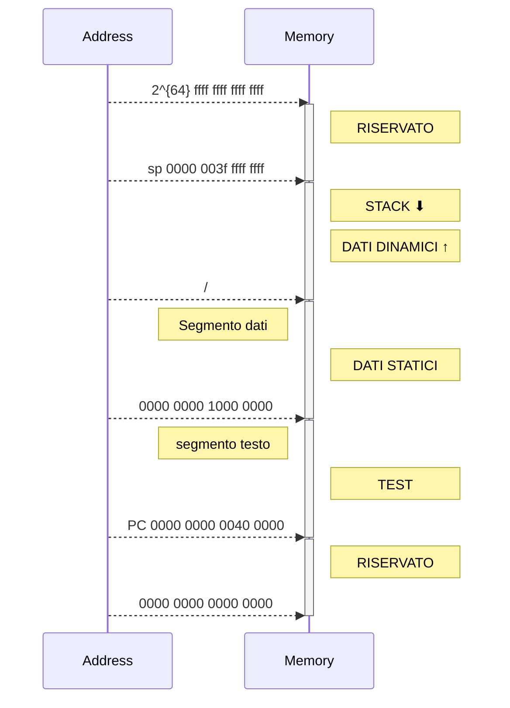

# Memoria
Memoria indirizzabile al singolo byte ed è divisa in parole:
 - Una parola $32$ bit contiene $4$ byte
 - Una parola doppia $64$ bit contiene $8$ byte

Gli indirizzi di memoria sono a 64 bit, espresso con indirizzamento a byte, e lo spazio di indirizzamento è di 16 exabyte ($2^{64}$ Byte).
Visto che le istruzioni occupano 32 bit hanno indirizzi allineati alla parola, multipli di 4 byte.

### Come assegnamo gli indirizzi ai byte?

>[!def] #### big endian
>
>...|...|...|...|indirizzo
>---|-|-|-|-|
>0|1|2|3|0
>4|5|6|7|4
>...|...|...|...|8
>Alla parola viene assegnato l'indirizzo del byte più significativo
>
0|1|2|3
-|-|-|-
0000 0000|0000 0000| 0000 0000 | 0000 0110


>[!def] #### little endian
>
>|...|...|...|...|indirizzo
>---|---|---|---|---
>3|2|1|0|0
>7|6|5|4|4
>...|...|...|...|8
>Alla parola viene assegnato l'indirizzo del byte meno significativo
>
>3|2|1|0
>-|-|-|-
>0000 0000|0000 0000| 0000 0000 | 0000 0110


La memoria può virtualmente (ossia massimo teorica) avere $2^{64}$ indirizzi




Area dati e area testo vengono dichiarate tramite direttive all'assemblatore: 

>[!multi-column]
>
>>[!clang]
>>```c
>>//variabili globali
>>int a
>>int b
>>...
>>
>>main()
>>{
>>//body
>>...
>>}
>>```
>
>>[!assembly]
>>```armasm
>>;0x0000 0000 1000 0000
>>.data
>>A: .word
>>B: .word
>>...
>>;0x0000 0000 0040 0000
>>.text
>>MAIN:
>>...
>>
>>;la stack non va dichiarata
>>```

>[!oss]
>Ricordiamo che le variabili all'interno della CPU sono nei [[registro|registri]], le variabili esterne alla CPU sono nella memoria.

## Dimensioni [[variabili]]

VAR | SIZE
 --- | ---
 `char` | 1 Byte
 `short int`| 2 Byte o 1 Half word
 `int` | 4 Byte o 1 word
 `long int`|8 Byte o una double word


# Memoria come [[Blocchi sequenziali|blocco sequenziale]]

- Memoria volatile, permette l'accesso in lettura e scrittura, ed ha una struttura a matrice le cui righe sono le parole di memoria a 32 bit con accesso direttiio


Un chip di memoria si caratterizza da:
- Capacità: numero di byte memorizzabili = numero di parole per 4 (ogni parola ha 4 byte)
- Funzioni: lettura e scrittura, solo lettura
- Numero di porte di accesso
- Tempo di accesso


Il contenuto è letto e scritto una parola per ciclo di [[clock]] e vi si accede attraverso un indirizzo fornito alla porta di accesso alla memoria, solitamente sia in scrittura che in lettura.

![[Pasted image 20221017180321.png]]

Gli ingressi di indirizzo codificano l'indirizzo della parola su cui scrivere o leggere, mentre le uscite o ingressi di dato servono per leggere o scrivere una parola.

Per le linee di dato e gli ingressi di indirizzo vanno rispettati i tempi di set up e di hold, segnali che vengono forniti in modo da essere stabili mentre le linee di comando sono attive

