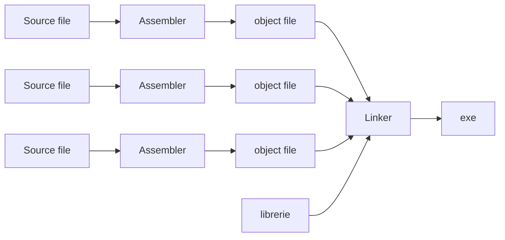

# Linker

Risolve le etichette e genera un codice binario, detto eseguibile. È il livello successivo all'[[assembler]]

```mermaid
graph LR
	a1[Source file] --> b1[Assembler] --> c1[object file]
	a2[Source file] --> b2[Assembler] --> c2[object file]
	a3[Source file] --> b3[Assembler] --> c3[object file]
	c1 --> d[Linker]
	c2 --> d
	c3 --> d
	a4[librerie] --> d
	d --> e[exe]
```