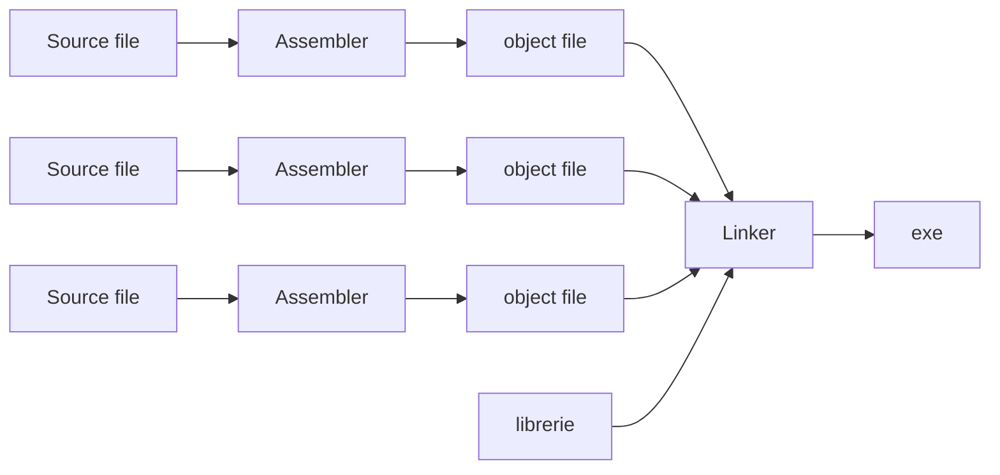

# Linker

Risolve le etichette e genera un codice binario, detto eseguibile, in formato rilocabile. È il livello successivo all'[[assembler]]

## Passo 1, determinazione della posizione in memoria dei moduli:
L'assemblatore alloca la sezione testo e la sezione dati a partire dall'indirizzo base 0 a passi di 4
I moduli devono essere caricati sequenzialmente, rispettando la struttura di [[memoria]]:

  Indirizzi alti| Base
 --- | ---
 dato del modulo B | 0x1000 0008
 dati del modulo MAIN | 0x1000 0000
 $\vdots$ | $\vdots$
 testo del modulo B | 0x0040 0014
 testo del modulo MAIN | 0x0040 0000
 **RESERVED** |0x0000 0000
 