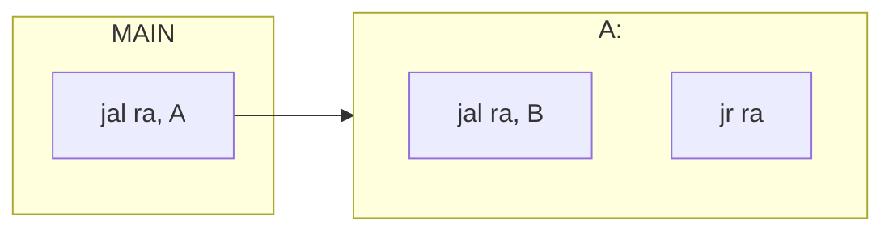

# Sottoprogrammi

### Chiamante (caller)
- Predispone i parametri da passare tramite i registri a2-a7
- Trasferisce il controllo al sotto programma tramite jump and link `jal`


### Chiamato (callee)
- Allocazione dell'area di attivazione su stack
- esecuzione
- Memorizza il risultato in a0/a1
- Restituisce tramite jr ra, ret


>[!esempio]
>
>#### chiamata:
>```armasm
>jal ra, label ;# jump and link, ra <--- PC + 4, ossia l'indirizzo di ritorno, terminato il sottoprogramma l'istruzione va al comando successivo al caller. PC <-- label
>
>```
>
>#### ritorno da sottoprogramma
>```armasm
>jr ra
>```


Tuttavia non può essere così semplice il sistema, infatti in questo modo si creano svariati problemi:

